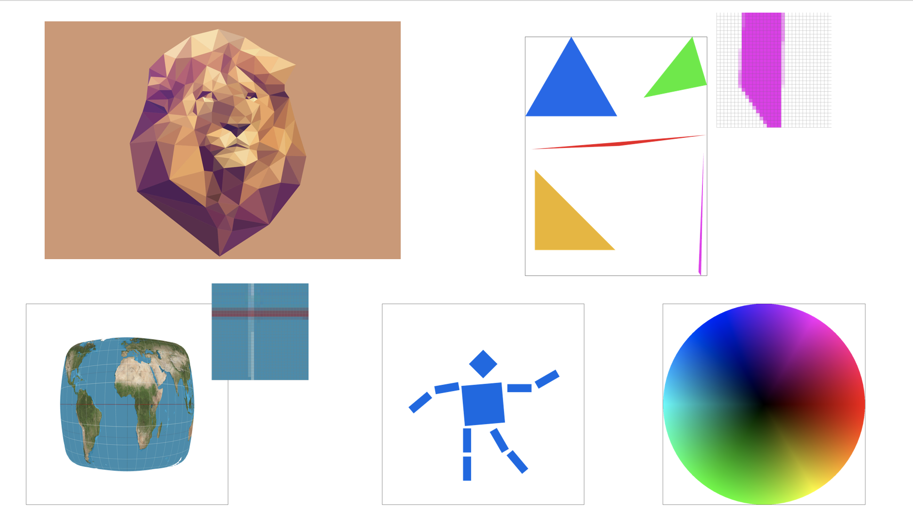

# Rasterizer
A simple rasterizer that utilizes supersampling with antialiasing and texture support

## Write-Up
You can read my detailed [writeup](https://michael-tu.github.io/Rasterizer/) to understand what features I have implemented, how I developed them, see many of the cool results, and view side-by-side comparisons of the performance by different techniques.

## Glimpse of Results



## Using the GUI

You can run the executable with the command:

_Note: You have to run the executable insdie the `build` folder, which will be explained in the next section_

```
./draw ../svg/my_examples/myrobot.svg
```

A robot should show up on your screen.

You can also change the viewpoint by dragging your mouse to pan around or scrolling to zoom in and out. 

Here are all the **keyboard shortcuts** available:

Key     | Action
------  | -------
' '     | return to original viewpoint
'-'     | decrease sample rate
'='     | increase sample rate
'Z'     | toggle the pixel inspector
'P'     | switch between texture filtering methods on pixels
'L'     | switch between texture filtering methods on mipmap levels
'S'     | save a png screenshot in the current directory
'1'-'9' | switch between svg files in the loaded directory

The argument passed to draw can either be a single file or a directory containing multiple svg files, as in

```
./draw ../svg/basic/
```

If you load a directory with up to 9 files, you can switch between them using the number keys 1-9 on your keyboard.

## Build System

If you don't have [CMake](https://cmake.org) (version >= 2.8) on your personal computer, you can install it using `apt-get` on Linux or `Macports/Homebrew` on OS X. Alternatively, you can download it directly from the CMake website.

To build the code, start in the folder that GitHub made or that was created when you unzipped the download. 

Run
```
mkdir build; cd build
```

to create a build directory and enter it, then

```
cmake ..
```

to have CMake generate the appropriate Makefiles for your system, then

```
make 
```

to make the executable, which will be deposited in the build directory.

