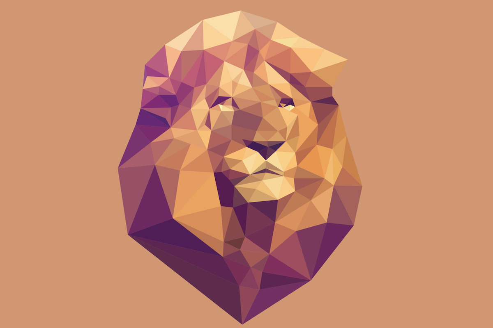

# Rasterizer
A simple rasterizer that utilizes supersampling with antialiasing and texture support

## Write-Up
You can read my detailed [writeup](https://michael-tu.github.io/Rasterizer/) to understand what features I have implemented, how I developed them, and see many of the cool results.

## Glimpse of Results

Tiger

Anti-aliased Triangle

Robot

Color Wheel

Map

